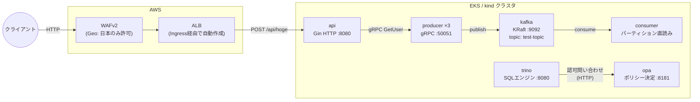
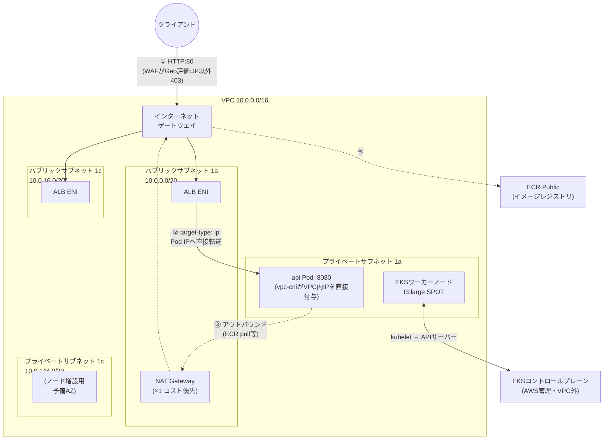

# demo-kube

Kubernetes 上のマイクロサービスデモプロジェクト。

## アーキテクチャ概要



- **api** (`backend/api`): Gin HTTPサーバー。エンドポイントは `GET /api/health` と `POST /api/hoge` のみ
- **producer** (`backend/kafka/producer`): gRPCサーバー。Kafka topic `test-topic` へpublish
- **consumer** (`backend/kafka/consumer`): Kafkaコンシューマー（グループ未使用・パーティション0直読み）
- **trino + opa**: OPAでアクセス制御するSQLクエリエンジン（ポリシーは `backend/deployment/base/opa/`）
- **common** (`backend/common`): `ckafka`（Writer/Readerコンストラクタ）と `cgrpc`（接続ヘルパー）
- **proto** (`backend/proto`): protobuf定義（`user.proto`）

## ネットワーク構成（EKS / AWS）



### ルートテーブル

| ルートテーブル | 関連付け | ルート |
|---|---|---|
| パブリックRT | パブリックサブネット ×2 | `10.0.0.0/16 → local` / `0.0.0.0/0 → IGW` |
| プライベートRT | プライベートサブネット ×2 | `10.0.0.0/16 → local` / `0.0.0.0/0 → NAT Gateway` |

- ワーカーノード・Podは**プライベートサブネット**にいるため、インターネットから直接到達できない（インバウンドはALB経由のみ）
- アウトバウンド（ECR Public のイメージpull等）はNAT Gateway経由。NATは1aに1つだけなので、1cのリソースのアウトバウンドも1aのNATを通る（コスト優先のシングルNAT構成）

### セキュリティグループ（通信経路の制御）

| SG | アタッチ先 | インバウンド許可 |
|---|---|---|
| ALB用SG（LBコントローラーが自動作成） | ALB | `0.0.0.0/0 → :80`（Geo制限はSGでなく**WAF**が担当） |
| ノードSG（EKSモジュールが作成） | ワーカーノード/Pod ENI | ALB用SG → Pod port（LBコントローラーが自動でルール追加）、ノード間通信、コントロールプレーン → kubelet |
| クラスタSG | コントロールプレーンENI | ノード ⇔ APIサーバー(443) |

### リクエストの通り道（まとめ）

```
インバウンド:  クライアント → IGW → ALB(パブリック)［WAFがここで評価］
              → ノードSGを通過 → api Pod(プライベート、:8080)
アウトバウンド: Pod → プライベートRT → NAT GW(パブリック1a) → IGW → インターネット
```

ポイントは **ALBの`target-type: ip`**。NodePort（ノードのポート経由）ではなく、vpc-cniがPodに付与したVPC内IPへALBが直接ルーティングするため、経路がシンプルでホップが少ない。

## 開発手順

### ローカル開発（kind）

```bash
kind create cluster --name demo-cluster --config backend/deployment/demo-cluster.yaml

# イメージビルド（リポジトリルートで実行）
docker build -t api:latest -f backend/api/Dockerfile .
docker build -t producer:latest -f backend/kafka/producer/Dockerfile .
docker build -t consumer:latest -f backend/kafka/consumer/Dockerfile .

kind load docker-image api:latest producer:latest consumer:latest --name demo-cluster

# 全サービスをデプロイ（kustomize）
kubectl apply -k backend/deployment/overlays/local

# E2E疎通確認
kubectl port-forward svc/api-service 8080:8080
curl -X POST localhost:8080/api/hoge          # 200 + producer の hostname が返る
kubectl logs deployment/consumer --tail=5     # "received message: ..." が出ればOK
```

### クラスタの切り替え（kind ⇔ EKS）

```bash
kubectl config use-context kind-demo-cluster   # ローカル（namespace: default）
kubectl config use-context demo-kube-dev       # EKS（namespace: demo、-n demo 必須）

# EKSクラスタを作り直したら context を再登録する
AWS_PROFILE=personal aws eks update-kubeconfig --name demo-kube-dev --region ap-northeast-1 --alias demo-kube-dev
```

### マニフェスト構成（kustomize）

```
backend/deployment/
├── base/               # 全6サービスの共通定義
├── overlays/local/     # kind用（namespace: default、ローカルイメージ）
├── overlays/develop/   # EKS用（namespace: demo、ECR Public、ALB Ingress + WAF）
└── demo-cluster.yaml   # kindクラスタ設定
```

`overlays/develop/ingress.yaml` の `${WAF_ACL_ARN}` プレースホルダーはCIのenvsubstで置換される。

### Kafka操作

```bash
kubectl exec -it kafka-0 -- bash
/opt/kafka/bin/kafka-topics.sh --list --bootstrap-server localhost:9092
/opt/kafka/bin/kafka-get-offsets.sh --bootstrap-server localhost:9092 --topic test-topic
```

topic `test-topic` は自動作成される。Kafkaのデータは emptyDir（非永続。デモ用途のため意図的）。

### Terraform（AWS、profile: personal）

```bash
# 初回1回のみ: tfstate用S3バケット（destroyしない）
cd backend/terraform/bootstrap && terraform init && terraform apply

# 検証セッションごと
cd backend/terraform/environments/dev
terraform init && terraform apply    # 約15〜20分
terraform destroy                    # 検証後は必ずdestroy（コスト対策）
```

- apply後
```bash
gh variable set WAF_ACL_ARN
```

### CI/CD（GitHub Actions）

`develop` へのpush → `.github/workflows/deploy.yml`（変更検知 → matrix並列ビルド → ECR Public push → kubectl apply → 検証 → api変更時はCodeBuild経由E2E）:

- common/proto の変更は全サービス再ビルド、個別変更は該当サービスのみ
- api 変更時（または手動実行時）は東京リージョンのCodeBuildからPlaywright APIテストを実行（GHAランナーはUS発のためWAFのGeo制限で403になる。これは仕様であり、WAF動作確認のネガティブテストとして組み込み済み）
- 必要な GitHub Variables（terraform output の値を設定）: `AWS_DEPLOY_ROLE_ARN` / `EKS_CLUSTER_NAME` / `WAF_ACL_ARN` / `E2E_CODEBUILD_PROJECT`

日本からのALB疎通確認:

```bash
kubectl --context demo-kube-dev get ingress api -n demo    # ALB DNSを取得
curl -X POST http://<ALB_DNS>/api/hoge
```
